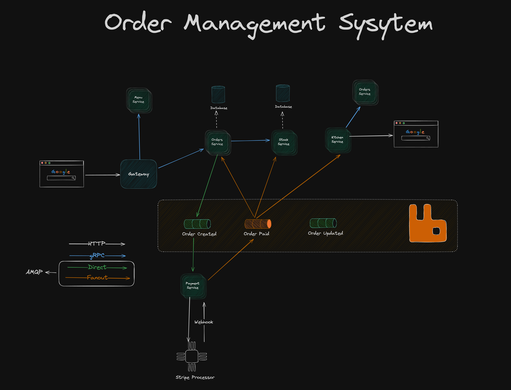

# Order Management System (OMS) microservice

A scalable and efficient Order Management System built using a microservices architecture. It handles order processing, payments, and inventory management with seamless communication between services.

### Tech Stack:

- Go - Version 1.23.4
- MongoDB – NoSQL database for storing orders and customer data
- RabbitMQ – Message broker for async communication between services
- gRPC - Comminicaton between services
- ~~Redis – Caching and session management~~
- Stripe – Secure payment processing
- Jaeger - For service tracing
- HasiCorps's Consul for service discovery
- Docker & Kubernetes – Containerization and orchestration

Designed for scalability, reliability, and flexibility

